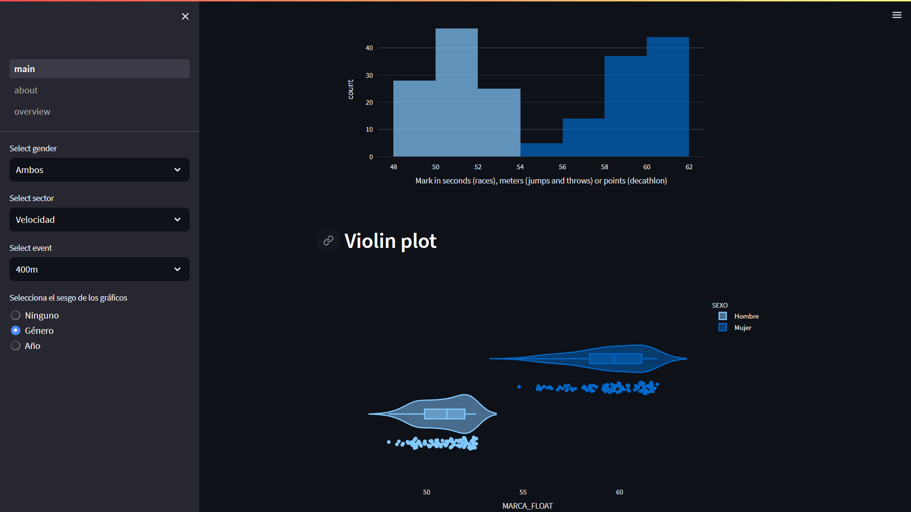

# Athletics ranking analysis

This project is a web app showing an exploratory analysis of the athletics ranking of the Spanish Athletics Federation.

The data is obtained from the [Spanish Athletics Federation](https://www.atletismorfea.es/ranking) in 2023.



## How to run

Run the following command to run:

```bash
python -m venv venv
source venv/bin/activate
pip install -r requirements.txt
streamlit run main.py
```

## TODO

- [x] Create a ranking that can be filtered and sorted
- [x] Create graphs for each chosen test of the ranking
- [x] Create a filter to divide the data between different categories (gender, age, etc.)
- [ ] Create a section to answer questions about the data
